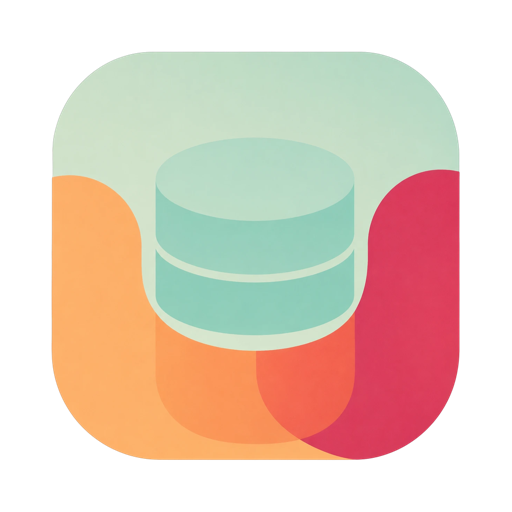

<div align="center">



# DataDock

**A sleek, modern desktop database client for MySQL, PostgreSQL, Redis & SQLite.**

Browse, query, edit, and visualize your databases — all from one minimalist, dark-themed workspace.

<br/>

[](https://www.electronjs.org/)
[](https://react.dev/)
[](https://www.typescriptlang.org/)
[](https://tailwindcss.com/)
[](https://electron-vite.org/)

<br/>


</div>

---

## ✨ Features

### 🔌 Connections

- Save connections for **MySQL, PostgreSQL, Redis, and SQLite** and reopen them instantly on relaunch.
- Passwords encrypted at rest via the OS keychain (Electron `safeStorage`) — never stored in plaintext.
- Optional **SSL/TLS** with CA, client certificate, and key files.
- Tag each connection with a **color** for at-a-glance identification (shown in the sidebar and as an accent bar atop the editor).
- Open multiple connections at once, each in its own workspace with independent tabs.

### 📋 Browse & edit (relational)

- Database picker, searchable table list, and a **tab per table**.
- Paginated row grids with **resizable columns** and **server-side sorting** (click a header to cycle asc → desc).
- **Server-side filtering** — pick a column, an operator (`=`, `≠`, `>`, `<`, `LIKE`, `contains`, `is null`, …), and a value.
- **Inline cell editing** — double-click a cell to edit; type-aware inputs (text, number, enum/boolean dropdowns) write back via a primary-key-scoped `UPDATE`.

### ⌨️ SQL editor

- CodeMirror 6 editor with syntax highlighting and a dialect tuned per connection.
- **Schema-aware autocomplete** of table and column names.
- Run with **⌘/Ctrl + Enter**; results render in the same fast grid.

### 🕸️ Relation diagram

- Auto-laid-out **ER diagram** of the database (powered by React Flow + dagre), with column-level foreign-key edges, primary/foreign-key markers, pan, zoom, and drag.

### 🧬 Redis

- Key browser with `SCAN`-based pattern search and per-key type badges.
- Type-aware value viewer for strings, lists, sets, sorted sets, and hashes.
- Built-in **command console**.

### 🎨 Design

- Minimalist, elegant dark UI with blue/purple accents, reusable component primitives, and tooltips throughout.

---

## 🛠️ Tech Stack

| Layer            | Technologies                                                               |
| ---------------- | -------------------------------------------------------------------------- |
| **Shell**        | Electron, [electron-vite](https://electron-vite.org/), electron-builder    |
| **UI**           | React 19, TypeScript, Tailwind CSS v4, Zustand, lucide-react, Radix UI     |
| **Editor & viz** | CodeMirror 6 (`@codemirror/lang-sql`), React Flow (`@xyflow/react`), dagre |
| **Drivers**      | `mysql2`, `pg`, `ioredis`, `better-sqlite3`                                |

Database drivers run in the Electron **main process** and are exposed to the renderer over a typed IPC bridge — the renderer never touches the network or filesystem directly.

---

## 🚀 Getting Started

### Prerequisites

- **Node.js 18+** (Node 22 recommended)
- npm

### Install

```bash
npm install
```

> The `postinstall` step rebuilds native modules (e.g. `better-sqlite3`) against Electron's ABI automatically.

### Develop

```bash
npm run dev
```

### Build

```bash
npm run build         # type-check + bundle
npm run build:mac     # package for macOS
npm run build:win     # package for Windows
npm run build:linux   # package for Linux
```

### Quality

```bash
npm run typecheck     # type-check main, preload, and renderer
npm run lint          # ESLint
npm run format        # Prettier
```

---

## 🗂️ Project Structure

```
src/
├── main/              # Electron main process
│   └── db/            # Connection manager, per-driver implementations, IPC, SSL, filters
├── preload/           # Typed contextBridge API (window.api)
├── shared/            # Types shared across main, preload, and renderer
└── renderer/          # React app
    └── src/
        ├── components/
        │   ├── ui/          # Reusable primitives (Button, Modal, Tabs, DataTable, …)
        │   ├── relational/  # Table view, query editor, relation diagram
        │   └── redis/       # Key browser & command console
        └── store/           # Zustand stores (connections, workspace)
```

### Architecture

```
Renderer (React)  ──invoke──▶  Preload (window.api)  ──IPC──▶  Main (DB drivers + secure store)
```

---

## 🗺️ Roadmap

Planned/possible enhancements:

- Export query results (CSV / JSON)
- Row insertion and deletion
- Persisted column widths and saved queries
- Additional connection types

---

## 📄 License

This project has not yet been assigned an open-source license. All rights reserved by the author until one is added.
