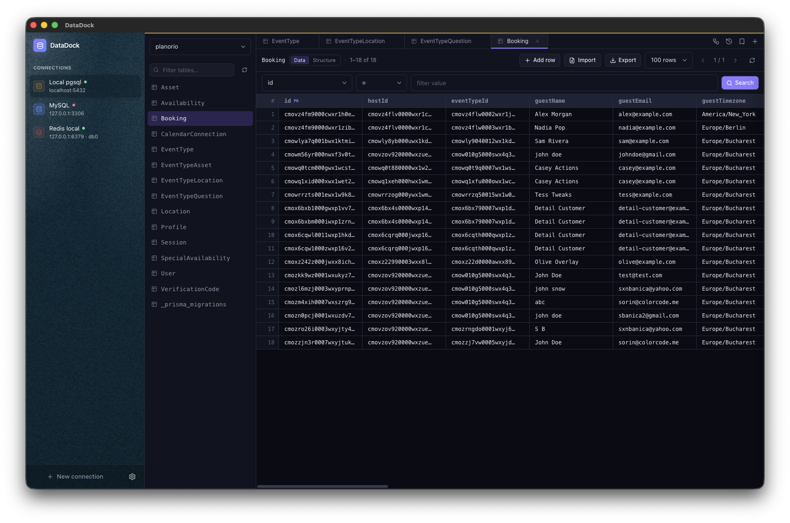

# TableDock

**A sleek, modern desktop database client for MySQL, MariaDB, PostgreSQL, SQL Server, MongoDB, Redis & SQLite.**

Browse, query, edit, and visualize your databases — all from one minimalist workspace with light & dark themes.

 

 

 

---

> 📖 See the [**User Guide**](docs/guide.md) for a screenshot walkthrough of every feature.
> 🛠️ See [**DEVELOPMENT.md**](DEVELOPMENT.md) for how to build, run, and test the project.

## ✨ Features

### 🔌 Connections

- Save connections for **MySQL, MariaDB, PostgreSQL, SQL Server, MongoDB, Redis, and SQLite** and reopen them instantly on relaunch.
- Passwords encrypted at rest via the OS keychain (Electron `safeStorage`) — never stored in plaintext.
- Optional **SSL/TLS** with CA, client certificate, and key files.
- **SSH tunneling** with password, private-key, or SSH-agent authentication (secrets encrypted alongside the connection).
- **Read-only mode** — flag a connection to block every write (inline edits, add/delete row, import, dumps), enforced in the main process.
- Tag each connection with a **color** for at-a-glance identification (shown in the sidebar and as an accent bar atop the editor).
- Open multiple connections at once, each in its own workspace with independent tabs.

### 📋 Browse & edit (relational)

- Database picker, searchable table list, and a **tab per table** with a **Data / Structure** toggle.
- Paginated row grids with **resizable columns** and **server-side sorting** (click a header to cycle asc → desc).
- **Server-side filtering** — pick a column, an operator (`=`, `≠`, `>`, `<`, `LIKE`, `contains`, `is null`, …), and a value.
- **Inline cell editing** — double-click a cell to edit; type-aware inputs (text, number, enum/boolean dropdowns) write back via a primary-key-scoped `UPDATE`.
- **Add row** and a row context menu to **copy as CSV / SQL**, copy a single cell, or delete a row.
- **Cell detail viewer** — expand any cell into a roomy panel to read/edit long text, pretty-printed JSON, or blobs.
- **Foreign-key navigation** — jump from an FK cell straight to the referenced row in a new, pre-filtered tab.
- **Table Structure view** — columns (type, nullability, default, PK, extra), indexes, and the `CREATE` statement.
- **Schema editing** — create databases and tables (column builder), add / drop columns, and rename / drop tables.

### 📤 Import & export

- **Export results** to **CSV or JSON** — the entire table or full filtered/sorted set, not just the visible page.
- **Import CSV / JSON** into a table — pick a file, auto-map columns (with per-column overrides), preview, and bulk-insert.
- **Import SQL** scripts (drag-and-drop or file picker) and **create dumps** (SQL for relational, JSON for Mongo, command stream for Redis) via the native menu.

### ⌨️ SQL editor

- CodeMirror 6 editor with syntax highlighting and a dialect tuned per connection.
- **Schema-aware autocomplete** of table and column names.
- Run with **⌘/Ctrl + Enter**; results render in the same fast grid with **execution time**.
- **Format** (dialect-aware pretty-printer) and **Explain** (query plan) buttons.
- **Destructive-statement guard** — confirms before running `UPDATE`/`DELETE` without a `WHERE`, or `TRUNCATE`/`DROP`.
- **Per-connection query history** and **saved queries** (named SQL snippets) in side panels — click to reopen in a new tab.

### 🤖 AI assistant (BYOK)

- Ask in plain English; the assistant returns a **dialect-correct SQL query** for the open database, grounded in its live schema.
- **Bring your own key** — OpenAI or Anthropic; the key is encrypted locally and only the schema (table/column names) is sent, never your data.
- Streamed replies with **Open in query tab** / **Copy** actions — you review and run; nothing executes automatically.

### 🎹 Command palette & shortcuts

- **⌘/Ctrl + K** opens a command palette to jump to a saved connection, open a table or new query, or run a quick action — with fuzzy filtering and arrow-key navigation.
- **⌘/Ctrl + T** opens a new query tab in the active relational connection.

### 🕸️ Relation diagram

- Auto-laid-out **ER diagram** of the database (powered by React Flow + dagre), with column-level foreign-key edges, primary/foreign-key markers, pan, zoom, and drag.

### 🍃 MongoDB

- Database + collection browser with a dedicated document workspace and per-collection **stats** (storage size, avg doc size, index count).
- Paginated documents rendered as Extended JSON, with **filter, sort, and projection** queries (fast `estimatedDocumentCount` for unfiltered browsing).
- **Aggregation pipeline** editor — run an Extended-JSON pipeline and view the results.
- **Index management** — list, create (keys / unique / name), and drop indexes.
- **Add / edit / delete documents** through a JSON editor (targets by `_id`); copy a document or its `_id`, and export results to JSON.
- **Collection management** — create, drop, and rename collections (gated by read-only mode).

### 🧬 Redis

- Key browser with `SCAN`-based pattern search, per-key type badges, and a `DBSIZE` count per database.
- Type-aware value viewer for strings, lists, sets, sorted sets, and hashes, with **TTL, memory, encoding, and element-count** insights, JSON pretty-printing, copy, and an in-panel filter.
- **Paginated collections** — large lists/sets/hashes/zsets load page-by-page rather than all at once.
- **Full editing** — create keys; edit string values; add/edit/remove hash fields and list/set/zset members; rename, set/clear TTL, or delete keys (all gated by read-only mode).
- Built-in **command console**.

### 🎨 Design

- Minimalist, elegant UI with blue/purple accents, reusable component primitives, tooltips, and **toast notifications** throughout.
- **Light / dark / system** theme modes, plus an Arc-style **customizable sidebar** (background color + pixelated noise) configured in a Settings modal.

---

## 🛠️ Tech Stack

| Layer            | Technologies                                                                              |
| ---------------- | ----------------------------------------------------------------------------------------- |
| **Shell**        | Electron, [electron-vite](https://electron-vite.org/), electron-builder                   |
| **UI**           | React 19, TypeScript, Tailwind CSS v4, Zustand, lucide-react, Radix UI                    |
| **Editor & viz** | CodeMirror 6 (`@codemirror/lang-sql`), sql-formatter, React Flow (`@xyflow/react`), dagre |
| **Drivers**      | `mysql2`, `pg`, `mssql`, `mongodb`, `ioredis`, `better-sqlite3`                           |

Database drivers run in the Electron **main process** and are exposed to the renderer over a typed IPC bridge — the renderer never touches the network or filesystem directly.

---

## 🗺️ Roadmap

Planned/possible enhancements:

- Relational index management (create / drop indexes)
- Batched bulk inserts and query cancellation
- Charts and column profiling from query results
- More database types (DuckDB, …)

---

## 📄 License

TableDock is licensed under the [Business Source License 1.1](LICENSE).

**Free for personal use.** For commercial use or use within an organization, a [one-time commercial license](https://colorcode.lemonsqueezy.com/checkout/buy/0f3e2ea5-512c-4203-9ad5-6193c690cd55) is required.

