# DataDock — User Guide

A walkthrough of DataDock's main features. Screenshots are generated from the
running app by `npm run docs:screenshots` (see [Regenerating screenshots](#regenerating-screenshots)).

## Getting started

Launch DataDock and you're greeted by the workspace: saved connections on the
left, the active connection's content on the right. With nothing open yet, the
welcome screen points you at the command palette.

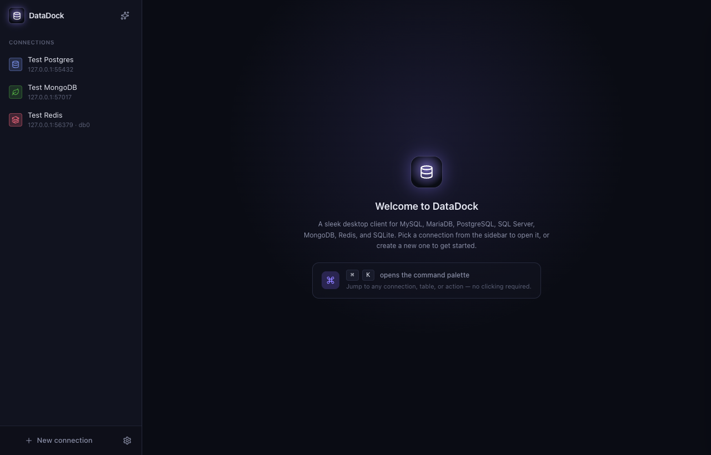

## Connections

Click **New connection** (or `⌘/Ctrl + K` → "New connection") to add a database.
Pick the type, fill in the host/port/credentials, optionally **Test** the
connection, then **Save**. Connections support:

- **SSL/TLS** with CA, client certificate, and key files.
- **SSH tunneling** (password, private key, or SSH agent).
- **Read-only mode** to block all writes.
- A **color tag** for quick visual identification in the sidebar.

Passwords and SSH secrets are encrypted at rest with the OS keychain.

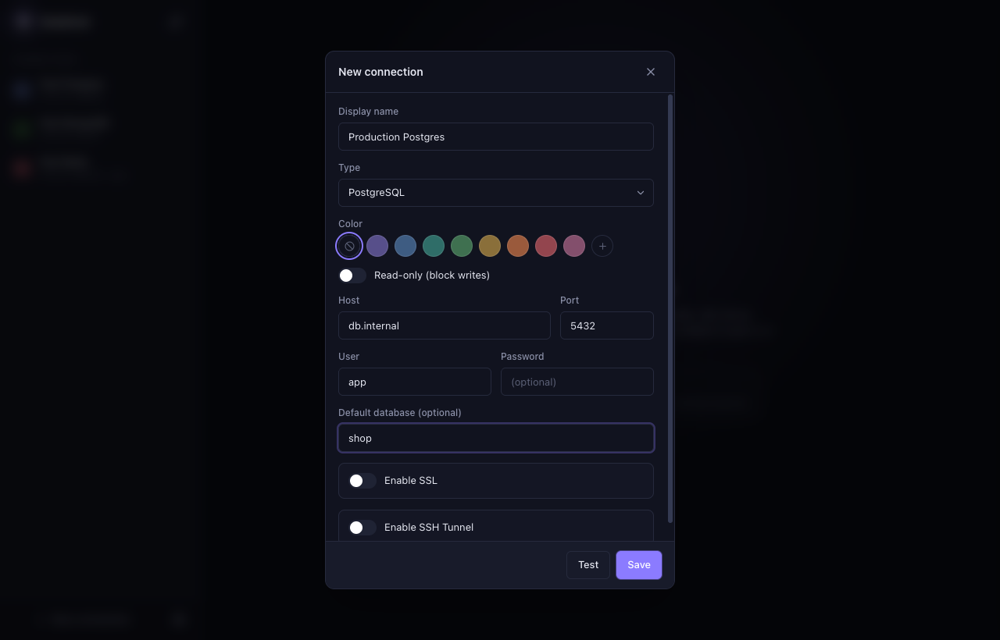

## Browsing & editing data

Open a connection to see its databases and tables. Pick a table to browse its
rows in a fast, paginated grid:

- **Sort** by clicking a column header; **filter** with the column / operator /
  value bar.
- **Inline edit** by double-clicking a cell, or open the full row/cell editors.
- **Foreign-key navigation** jumps from a reference to the related row.
- **Import** CSV/JSON into a table and **Export** the full result set.

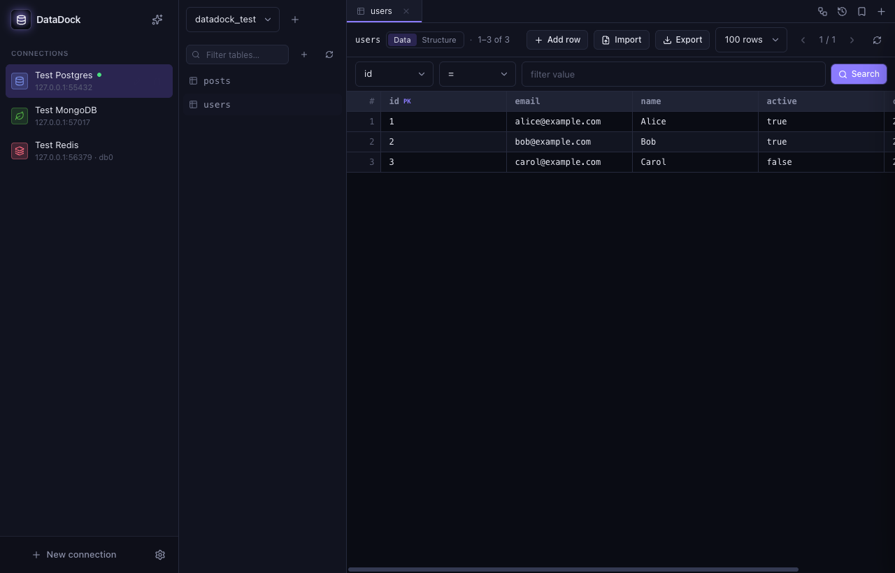

### Table structure & schema editing

The **Structure** toggle shows the table's columns, indexes, and `CREATE`
statement. From here (and the table list) you can create databases and tables,
add or drop columns, and rename or drop tables.

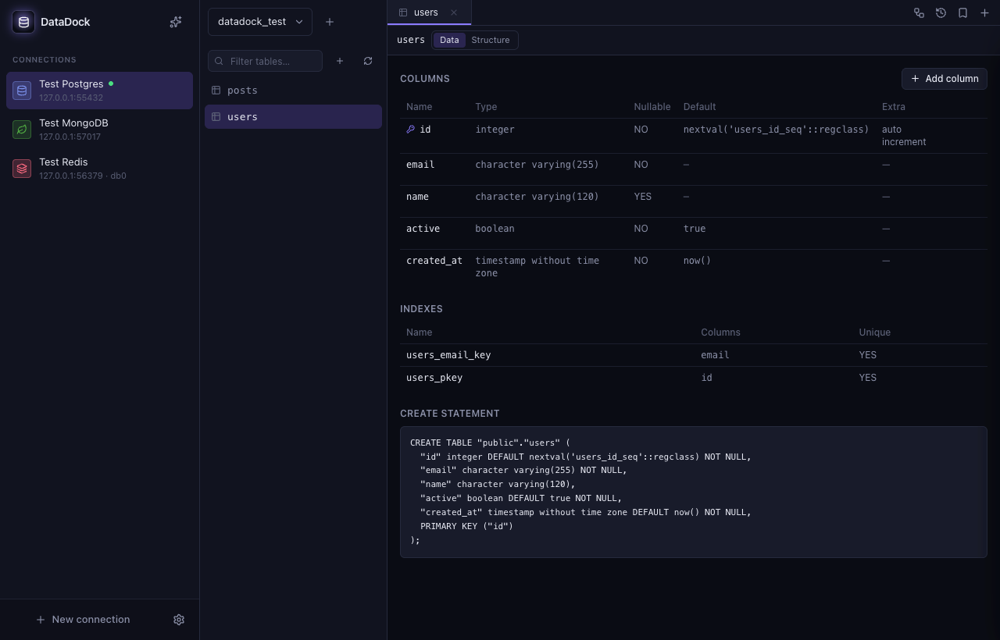

## Running SQL

Open a query tab to write SQL with syntax highlighting and schema-aware
autocomplete. Run with **⌘/Ctrl + Enter**; results appear in the same grid with
the row count and execution time. The toolbar also offers **Format** and
**Explain**, and there's a destructive-statement guard for `UPDATE`/`DELETE`
without a `WHERE`. Query **history** and **saved queries** live in side panels.

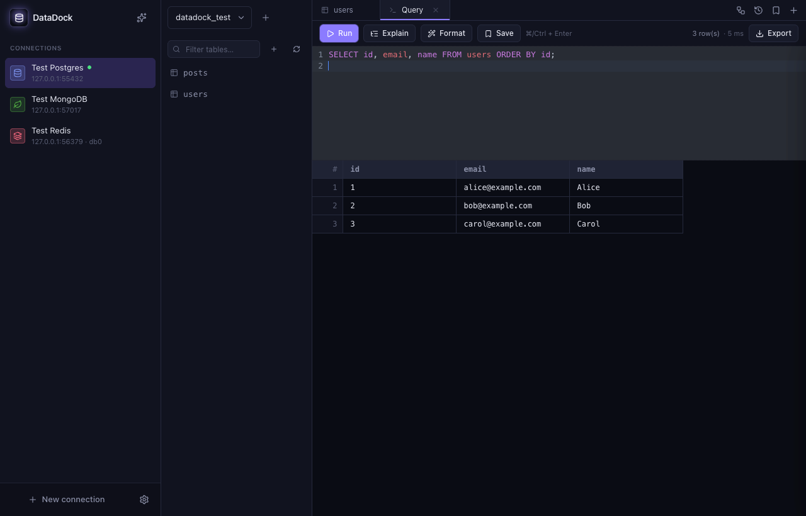

## Relation diagram

The **Relations** view auto-lays-out an ER diagram of the database, with
column-level foreign-key edges and primary/foreign-key markers. Pan, zoom, and
drag tables around.

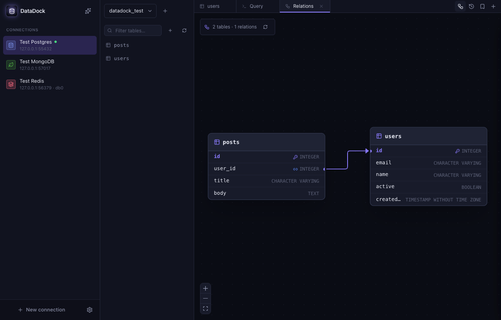

## MongoDB

MongoDB connections get a document workspace: browse collections, query with
**filter / sort / projection**, run an **aggregation pipeline**, manage
**indexes**, and add/edit/delete documents. The header shows collection stats.

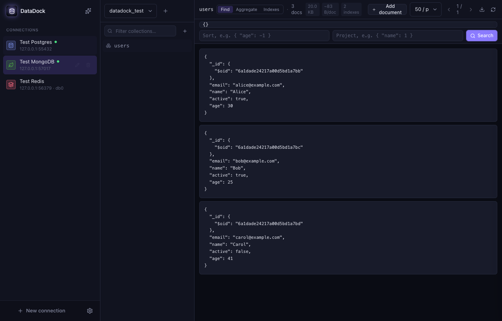

## Redis

Redis connections provide a key browser with `SCAN` search and type badges. The
value viewer is type-aware (string/list/set/zset/hash) and shows TTL, memory,
encoding, and element count, with JSON pretty-printing and an in-panel filter.
You can create keys, edit values, set TTLs, rename, and delete — plus a built-in
command console.

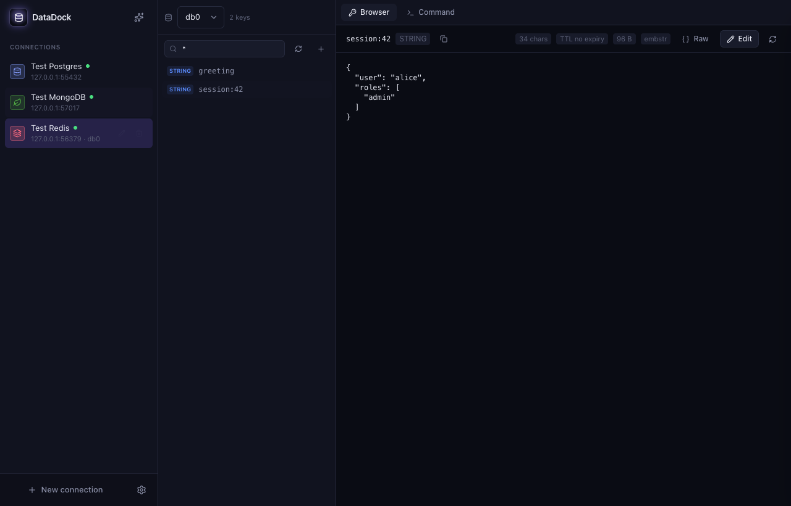

## AI assistant (bring your own key)

Click the ✨ button in the sidebar header to open the AI assistant. First, add an
OpenAI or Anthropic API key in **Settings → AI Assistant** — your key is
encrypted and stored locally, and only the database **schema** (table and column
names) is sent to the provider, never your data.

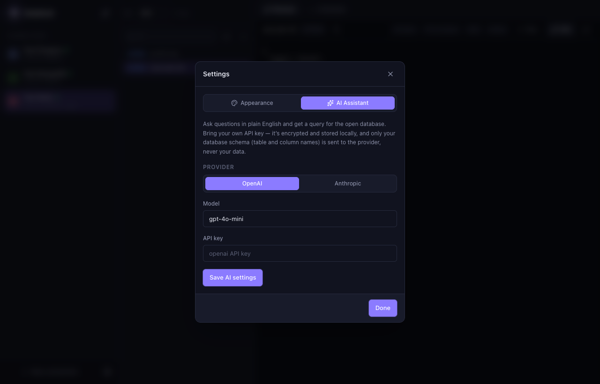

Then ask in plain English; the assistant streams back a query for the open
database's dialect. Review it, then **Open in query tab** to run it (the usual
destructive-statement guard still applies) or **Copy** it. Nothing runs
automatically.

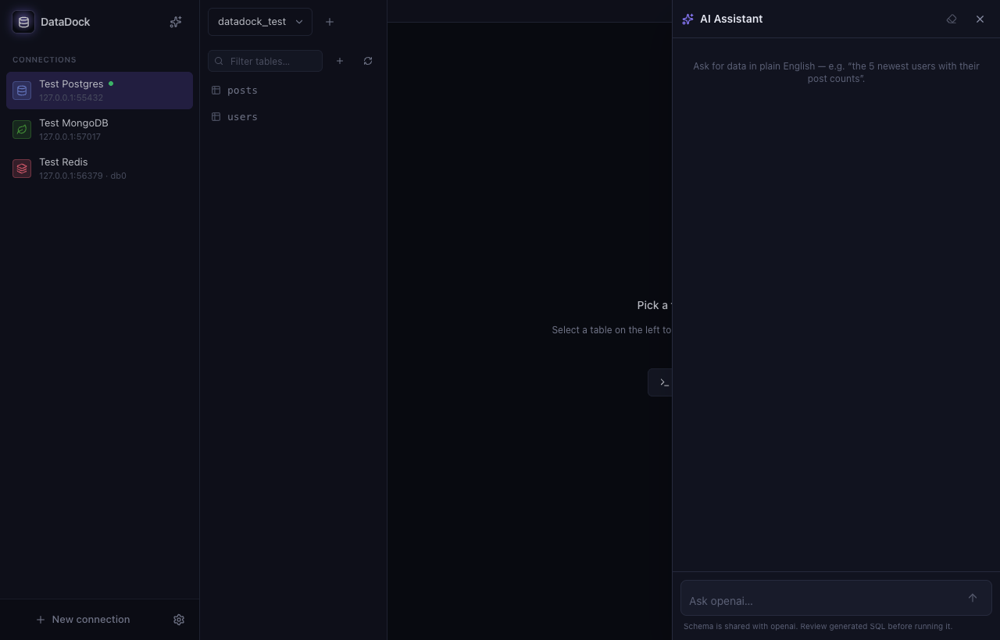

## Command palette & shortcuts

Press **⌘/Ctrl + K** to open the command palette — jump to any saved connection,
open a table or new query, or run a quick action, all with fuzzy filtering and
arrow-key navigation. **⌘/Ctrl + T** opens a new query tab.

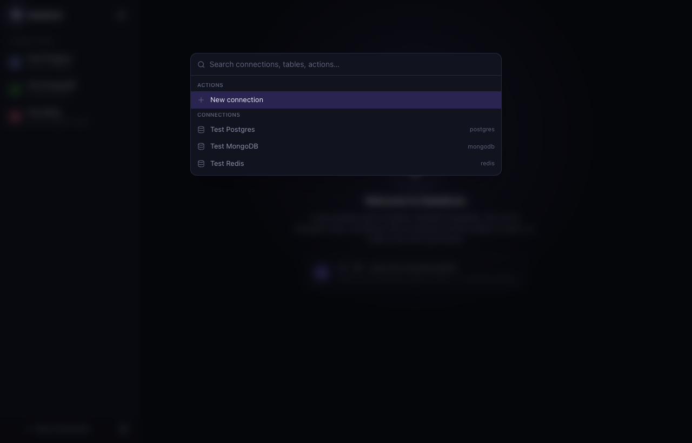

## Regenerating screenshots

The images above are captured by driving the built app with Playwright. With
Docker running:

```bash
npm run docs:screenshots
```

This starts the seeded test databases, builds the app, and runs
`test/screenshots/capture.spec.ts`, which launches DataDock against a throwaway
profile, navigates each screen, and writes the PNGs into `docs/screenshots/`.
